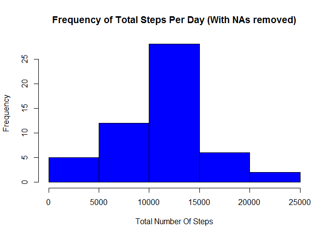
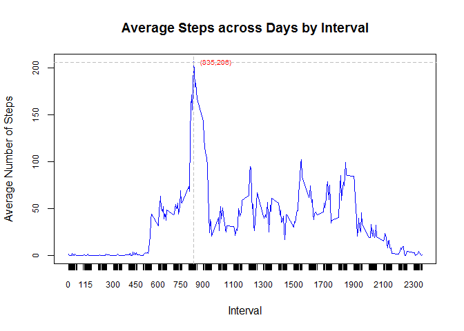
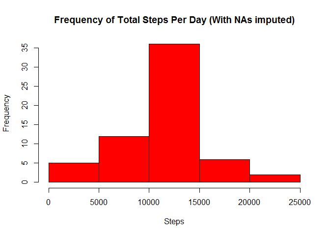
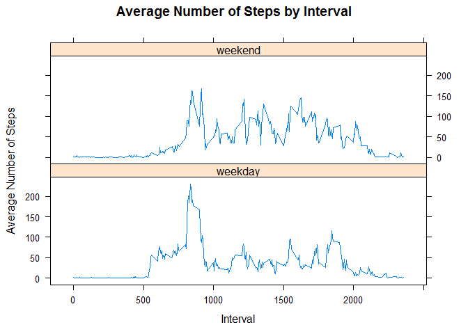

# Reproducible Research: Peer Assessment 1


```r
        ##Working off the forked version from https://github.com/rdpeng/RepData_PeerAssessment1
        suppressWarnings(library(knitr))
        opts_chunk$set(echo = TRUE)
        opts_chunk$set(fig.path = "./figures/")
```


```r
        ##Load all the required libraries for the program
        ##Ignore the warnings as those have been checked to be harmless
        
        suppressWarnings(library(lubridate)) ##Required for date manipulation
        suppressWarnings(library(reshape2)) ##For melt and cast
        suppressWarnings(library(lattice)) ##Will use Lattice Graphing system for the last plot
        suppressWarnings(suppressMessages(library(dplyr)))##Required to mutate
```

## Loading and preprocessing the data

```r
        ##---Start of Code for loading and preprocessing data ---
        ##Check if the activity data zip file exists in the current directory
        zippeddatafile <-"activity.zip"
        if (!file.exists(zippeddatafile))
                error("activity.zip file not found!")
        
        ##Unzip and then check if the activity.csv file exists. Full-proof mechanism
        unzip(zippeddatafile)
        filename<-"activity.csv"
        if (!file.exists(filename))
                error("Activity data file activity.csv not found!")
        
        ##Now read the file in with the right parameters.
        activitydata <-read.table(filename, header=TRUE, sep=",", na.strings="NA", 
                                stringsAsFactors=FALSE,
                                colClasses=c("numeric","character","numeric"))

        ##Mutate the dataframe to convert Date into Date format. 
        ##The colClasses=date was a bit unreliable. Hence a separate step
        activitydata<-mutate(activitydata, date=as.Date(ymd(date)))
        totalactivities<-nrow(activitydata) ##17568. So file read correctly.
```

- The total number of records read is **17568**

## What is mean total number of steps taken per day?


```r
        ##---Start of Code to Answer Q1 ---

        ##Remove the NA values. Using activitydata data frame from loaddata r code chunk above
        nonaactivitydata<-subset(activitydata, !is.na(steps))

        ##One can use group by approach below but I like melt and cast

        ##Now melt the data set with date as ID.
        meltedactivitydatabydate <- melt(nonaactivitydata, id.vars = c("date"), measure.vars=c("steps"))
        
        ##Then cast the data set with date as ID and calculate the sum by date (day)
        castedactivitydatabydate <- dcast(meltedactivitydatabydate, date~variable,sum)
        
        ##Plot the histogram of total steps per day
        par(mfcol=c(1,1))
        hist(castedactivitydatabydate$steps, xlab="Total Number Of Steps", 
                ylab="Frequency", main="Frequency of Total Steps Per Day (With NAs removed)", col="blue")
```

 

```r
        ##Calculate the mean and the median of the total number of steps per day as required
        meansteps<-mean(castedactivitydatabydate$steps)
        mediansteps<-median(castedactivitydatabydate$steps)

        ##---End of Code to Answer Q1 ---
```

- The mean of the total number of steps per day with NAs removed is **10766.18868**

- The median of the total number of steps per day with NAs removed is **10765.00000**


## What is the average daily activity pattern?

```r
        ##---Start of Code to Answer Q2 ---

        ##Using the nonaactivitydata dataframe from totalstepsperday r code chunk above
        nonaactivitydata<-subset(activitydata, !is.na(steps))

        ##One can use group by approach below but I like melt and cast

        ##First melt the data set with interval as ID
        meltedactivitydatabyinterval <- melt(nonaactivitydata, id.vars = c("interval"),
                                  measure.vars=c("steps"))

        ##Now cast the data set with interval as ID and calculate the mean
        castedactivitydatabyinterval <- dcast(meltedactivitydatabyinterval, interval~variable,mean)

        ##Extact max average steps and the corresponding interval . 
        ##This also helps identify max point on the graph (decorating the plot a bit)
        maxaveragesteps<-max(castedactivitydatabyinterval$steps)
        intervalwithmaxaveragesteps<-castedactivitydatabyinterval[which(castedactivitydatabyinterval$steps==maxaveragesteps), ][1,1]
        maxaveragesteps<-round(maxaveragesteps)

        ##Plot the Interval (x-axis) vs Total steps (y-axis)
        par(mfcol=c(1,1))
        with(castedactivitydatabyinterval, {plot(interval, steps, type="l", 
                main="Average Steps across Days by Interval",
                xlab="Interval",
                ylab="Average Number of Steps", col="blue", , xaxt="n", cex.axis=0.75)
             
                axis(1, at=interval,labels=interval, col.axis="black", las=0, cex.axis=0.75)
                 
                text(intervalwithmaxaveragesteps, maxaveragesteps, paste0("(", intervalwithmaxaveragesteps, ",",
                        maxaveragesteps, ")"), cex=0.60, pos=4, col="red")
                
                ##Horizontal Line
                abline(h = maxaveragesteps, col = "grey", lty=2)
                
                ##Vertical Line
                abline(v = intervalwithmaxaveragesteps, col = "grey", lty=2)
                
                                                
                }       
             
         )
```

 

```r
        ##---End of Code to Answer Q2 ---
```

- The 5-minute interval that contains the maximum number of steps **206** (rounded) is **835**

- Daily activity pattern indicates that people beging their activities at approximately 5:30am and peaks 8:30am. There are some spurts throughout the day (lunch time, late afternoon and early evening) and the activity dies down around 9:30pm.

## Imputing missing values
**Strategy is to impute NAs for an interval with the average for that specific interval across days. This is the most granular approach to minimize any significant variation/deviation as a result of imputing. In retrospective, the results below confirm this statement.**


```r
        ##---Start of Code to Answer Q3 ---

        ##Determine the total number of NA values
        numberofna <-sum(is.na(activitydata$steps))
        
        ##Make a copy of the origianl activity data set
        nacorrectedactivitydata<-activitydata
        
        ##Strategy is to impute NAs with the average for that specific interval across days
        ##Following loop imputes NAs with the average for that specific interval.
        ##Using the castedactivitydatabyinterval dataframe from meanstepsbyinterval r code chunk above

        for (i in 1:nrow(nacorrectedactivitydata)){
        
                
                currentsteps<-nacorrectedactivitydata$steps[i]
                currentinterval<-nacorrectedactivitydata$interval[i]
                
                ##Imput only if the currentsteps is NA
                if (is.na(currentsteps)){
                                     
                        nacorrectedactivitydata$steps[i]<-castedactivitydatabyinterval[which(castedactivitydatabyinterval$interval==currentinterval), ][1,2]
                
                }
                  
        }

        ##One can use group by approach below but I like melt and cast

        ##Melt the data set with date ID.
        meltedactivitydatabydate <- melt(nacorrectedactivitydata, id.vars = c("date"), measure.vars=c("steps"))
        
        ##Then cast the data set with date as IDs and calculate the sum by date (day)
        castedactivitydatabydate <- dcast(meltedactivitydatabydate, date~variable,sum)

        ##Plot the histogram of total steps per day
        par(mfcol=c(1,1))
        hist(castedactivitydatabydate$steps, xlab="Steps", 
                ylab="Frequency", main="Frequency of Total Steps Per Day (With NAs imputed)", col="red")
```

 

```r
        ##Calculate the mean and the median of the total number of steps per day
        meansteps<-mean(castedactivitydatabydate$steps)
        mediansteps<-median(castedactivitydatabydate$steps)

        ##---End of Code to Answer Q3 ---
```

- The total number of NAs in the original activity dataset is **2304**

- The mean of the total number of steps per day with NAs imputed is **10766.18868**

- The median of the total number of steps per day with NAs imputed is **10766.18868**

- Since the number of rows with NAs is **2304** out of a total of **17568** and since we imputed these values more granularly with mean of the time slots, there is not a significant difference between the before and after means and medians. In fact, mean does not seem to change at all and there is a minor differnece in median. The histogram does point to a some difference in the frequency distrbution obviously because of addition of **2304** in the plot!

## Are there differences in activity patterns between weekdays and weekends?


```r
        ##---Start of Code to Answer Q4 ---

        ##Using the nacorrectedactivitydata dataframe from imputesteps r code chunk above

        ##Add dayofweek as factor variables to capture weekday vs weekend
        ##Using wday instead of weekdays as it is much easier to compare. 
        ##wday returns 1 for Sun and 7 for Sat. 
        ##Note: I thought it would return 6 for Sat and 7 for Sun but no!
        nacorrectedweekdayactivitydata<-mutate(nacorrectedactivitydata, dayofweek=factor(1*(wday(date)==1 | wday(date)==7), labels=c("weekday", "weekend")))

        ##One can use group by approach below but I like melt and cast
        ##First melt the data set with interval as ID
        meltedactivitydatabyinterval <- melt(nacorrectedweekdayactivitydata, id.vars = c("dayofweek", "interval"),
                                  measure.vars=c("steps"))

        ##Now cast the data set with dayofweek and interval as ID and calculate the mean
        castedactivitydatabyinterval <- dcast(meltedactivitydatabyinterval, dayofweek+interval~variable,mean)

        
        ##Plot using the lettuce system. Yes, so that it looks similar to the sample provided.
        xyplot(steps~interval|dayofweek, data=castedactivitydatabyinterval, type="l",
                main="Average Number of Steps by Interval",
                xlab="Interval",
                ylab="Average Number of Steps", layout=c(1,2))
```

 

```r
        meanweekday<-mean(subset(castedactivitydatabyinterval$steps, castedactivitydatabyinterval$dayofweek=="weekday"))
        meanweekend<-mean(subset(castedactivitydatabyinterval$steps, castedactivitydatabyinterval$dayofweek=="weekend"))
        ##---End of Code to Answer Q4 ---
```
 
- The mean number of steps on weekday is **35.61058**

- The mean number of steps on weekend is **42.36640**

- **Yes, there are indeed differences in the activities on weekdays vs weekends. **

- On Weekdays, people are on an average less active than on Weekends as indicated by lower mean on Weekdays.

- Also, distribution of activity across the intervals is different for Weekdays compared to Weekends. On Weekends, there is higher spurts of activity throughout the day as indicated by the greater peaks on the graph. But people do register more steps on weekdays in approximately the **500 to 1000 interval** and then later approximately between **1900 to 2000 interval**. This impliees people are more active during morning times and later in the evening times on weekdays as compared to weekends (I guess, more running/walking before staring work).

**--------------------------------------------End of the report---------------------------------------------------**
