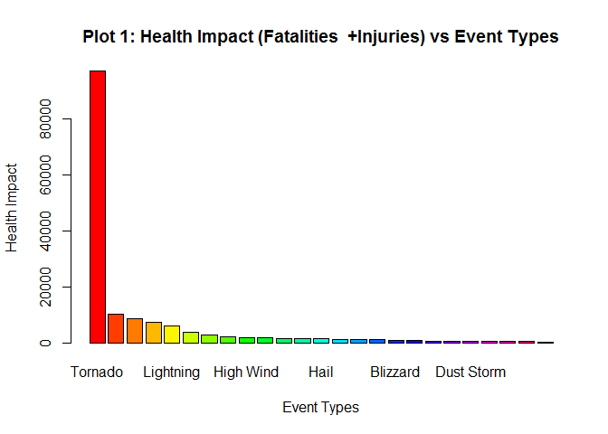
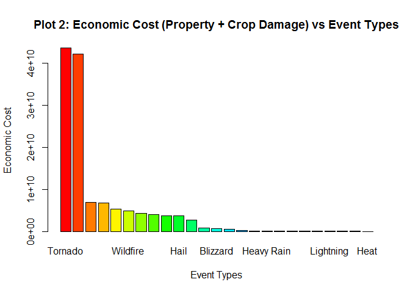

# NOAA Storm Database Exploration for Health Impact and Economic Cost


```r
        suppressWarnings(library(knitr))
        opts_chunk$set(echo = TRUE)
        opts_chunk$set(fig.path = "./figures/")
```


```r
        ##Load all the required libraries for the program
        ##Ignore the warnings as those have been checked to be harmless
        
        suppressWarnings(library(lubridate)) ##Required for date manipulation
        suppressWarnings(library(reshape2)) ##For melt and cast
        suppressWarnings(library(lattice)) ##Will use Lattice Graphing system for the last plot
        suppressWarnings(suppressMessages(library(dplyr)))##Required to mutate
        suppressWarnings(library(xtable)) ##To output tables
```

## Loading and preprocessing the data

```r
        ##---Start of Code for downloading, reading and preprocessing data ---

        ##Download and unzip the data file
        zippeddataURL<-("https://d396qusza40orc.cloudfront.net/repdata%2Fdata%2FStormData.csv.bz2")

        ##Download the Zip File only if it is not already there.
        zippeddatafile <-"StormData.csv.bz2"

        if (!file.exists(zippeddatafile)){                
                download.file(zippeddataURL, zippeddatafile)
                dateDownloaded<-date()                                        
        }
                
        ##Now read the file in with the right parameters.
        wipstormdata <-read.table(zippeddatafile, header=TRUE, sep=",", na.strings="NA", 
                                stringsAsFactors=FALSE)

        ##Total number of entries
        entries<-nrow(wipstormdata) ##902297. So file read correctly.

        ##Let us first see how many unique event types are in the storm data 
        eventtypesindata<-unique(wipstormdata$EVTYPE)
```

- The total number of records read is **902297**
- The total number of unique event types in the storm data is **985**


##Q1: Across the United States, which types of events are most harmful with respect to population health?


```r
        ##---Start of Code to Answer Q1 ---
        ##Using storm data frame from loaddata r code chunk above. Remove the NAs. Retain values that are non-zero.  This is being done given the question to be answered w.r.t fatalities and injuries (harmful to population health)
        wipstormdata<-subset(wipstormdata, !is.na(FATALITIES) & !is.na(INJURIES) & (FATALITIES>0 | INJURIES>0))

        ##One can use group by approach below but I like melt and cast
        ##Now melt the data set with event type as ID.
        meltedstormdatabyevent <- melt(wipstormdata, id.vars = c("EVTYPE"), measure.vars=c("FATALITIES", "INJURIES"))
        
        ##Then cast the data set with event type as ID and calculate the average by event type
        castedstormdatabyevent <- dcast(meltedstormdatabyevent, EVTYPE~variable,sum)
                                
        ##Introduce a column HEALTHIMPACT that is a sum of FATALITIES and INJURIES
        castedstormdatabyevent <- mutate(castedstormdatabyevent, HEALTHIMPACT=round(FATALITIES+INJURIES))
        
        ##Order by HEALTHIMPACT
        castedstormdatabyevent<-arrange(castedstormdatabyevent,desc(HEALTHIMPACT))

        ##Get the max health impact and the corresponding event
        maxheathimpact<-max(castedstormdatabyevent$HEALTHIMPACT)
        eventtypewithmaxheathimpact<-castedstormdatabyevent[which(castedstormdatabyevent$HEALTHIMPACT==maxheathimpact), ][1,1]

        top25<-head(castedstormdatabyevent, 25)
        par(mfcol=c(1,1))
        barplot(top25$HEALTHIMPACT, names.arg=top25$EVTYPE, main="Plot 1: Health Impact (Fatalities+Injuries) vs Event Types", 
          xlab="Event Types", ylab="Health Impact", col=rainbow(25))
```

 

```r
        ##Print the table (the top 25 rows)
        ##top25<-mutate(top25, FATALITIES=prettyNum(FATALITIES, big.mark=","),INJURIES=prettyNum(INJURIES, big.mark=","), HEALTHIMPACT=prettyNum(HEALTHIMPACT, big.mark=","))

        healthimpact<-xtable(top25, caption="Table 1: Health Impact for top 25 event types")
        print(healthimpact, type="html")
```

<!-- html table generated in R 3.2.0 by xtable 1.7-4 package -->
<!-- Wed Sep 23 21:31:34 2015 -->
<table border=1>
<caption align="bottom"> Table 1: Health Impact for top 25 event types </caption>
<tr> <th>  </th> <th> EVTYPE </th> <th> FATALITIES </th> <th> INJURIES </th> <th> HEALTHIMPACT </th>  </tr>
  <tr> <td align="right"> 1 </td> <td> TORNADO </td> <td align="right"> 5633.00 </td> <td align="right"> 91346.00 </td> <td align="right"> 96979.00 </td> </tr>
  <tr> <td align="right"> 2 </td> <td> EXCESSIVE HEAT </td> <td align="right"> 1903.00 </td> <td align="right"> 6525.00 </td> <td align="right"> 8428.00 </td> </tr>
  <tr> <td align="right"> 3 </td> <td> TSTM WIND </td> <td align="right"> 504.00 </td> <td align="right"> 6957.00 </td> <td align="right"> 7461.00 </td> </tr>
  <tr> <td align="right"> 4 </td> <td> FLOOD </td> <td align="right"> 470.00 </td> <td align="right"> 6789.00 </td> <td align="right"> 7259.00 </td> </tr>
  <tr> <td align="right"> 5 </td> <td> LIGHTNING </td> <td align="right"> 816.00 </td> <td align="right"> 5230.00 </td> <td align="right"> 6046.00 </td> </tr>
  <tr> <td align="right"> 6 </td> <td> HEAT </td> <td align="right"> 937.00 </td> <td align="right"> 2100.00 </td> <td align="right"> 3037.00 </td> </tr>
  <tr> <td align="right"> 7 </td> <td> FLASH FLOOD </td> <td align="right"> 978.00 </td> <td align="right"> 1777.00 </td> <td align="right"> 2755.00 </td> </tr>
  <tr> <td align="right"> 8 </td> <td> ICE STORM </td> <td align="right"> 89.00 </td> <td align="right"> 1975.00 </td> <td align="right"> 2064.00 </td> </tr>
  <tr> <td align="right"> 9 </td> <td> THUNDERSTORM WIND </td> <td align="right"> 133.00 </td> <td align="right"> 1488.00 </td> <td align="right"> 1621.00 </td> </tr>
  <tr> <td align="right"> 10 </td> <td> WINTER STORM </td> <td align="right"> 206.00 </td> <td align="right"> 1321.00 </td> <td align="right"> 1527.00 </td> </tr>
  <tr> <td align="right"> 11 </td> <td> HIGH WIND </td> <td align="right"> 248.00 </td> <td align="right"> 1137.00 </td> <td align="right"> 1385.00 </td> </tr>
  <tr> <td align="right"> 12 </td> <td> HAIL </td> <td align="right"> 15.00 </td> <td align="right"> 1361.00 </td> <td align="right"> 1376.00 </td> </tr>
  <tr> <td align="right"> 13 </td> <td> HURRICANE/TYPHOON </td> <td align="right"> 64.00 </td> <td align="right"> 1275.00 </td> <td align="right"> 1339.00 </td> </tr>
  <tr> <td align="right"> 14 </td> <td> HEAVY SNOW </td> <td align="right"> 127.00 </td> <td align="right"> 1021.00 </td> <td align="right"> 1148.00 </td> </tr>
  <tr> <td align="right"> 15 </td> <td> WILDFIRE </td> <td align="right"> 75.00 </td> <td align="right"> 911.00 </td> <td align="right"> 986.00 </td> </tr>
  <tr> <td align="right"> 16 </td> <td> THUNDERSTORM WINDS </td> <td align="right"> 64.00 </td> <td align="right"> 908.00 </td> <td align="right"> 972.00 </td> </tr>
  <tr> <td align="right"> 17 </td> <td> BLIZZARD </td> <td align="right"> 101.00 </td> <td align="right"> 805.00 </td> <td align="right"> 906.00 </td> </tr>
  <tr> <td align="right"> 18 </td> <td> FOG </td> <td align="right"> 62.00 </td> <td align="right"> 734.00 </td> <td align="right"> 796.00 </td> </tr>
  <tr> <td align="right"> 19 </td> <td> RIP CURRENT </td> <td align="right"> 368.00 </td> <td align="right"> 232.00 </td> <td align="right"> 600.00 </td> </tr>
  <tr> <td align="right"> 20 </td> <td> WILD/FOREST FIRE </td> <td align="right"> 12.00 </td> <td align="right"> 545.00 </td> <td align="right"> 557.00 </td> </tr>
  <tr> <td align="right"> 21 </td> <td> RIP CURRENTS </td> <td align="right"> 204.00 </td> <td align="right"> 297.00 </td> <td align="right"> 501.00 </td> </tr>
  <tr> <td align="right"> 22 </td> <td> HEAT WAVE </td> <td align="right"> 172.00 </td> <td align="right"> 309.00 </td> <td align="right"> 481.00 </td> </tr>
  <tr> <td align="right"> 23 </td> <td> DUST STORM </td> <td align="right"> 22.00 </td> <td align="right"> 440.00 </td> <td align="right"> 462.00 </td> </tr>
  <tr> <td align="right"> 24 </td> <td> WINTER WEATHER </td> <td align="right"> 33.00 </td> <td align="right"> 398.00 </td> <td align="right"> 431.00 </td> </tr>
  <tr> <td align="right"> 25 </td> <td> TROPICAL STORM </td> <td align="right"> 58.00 </td> <td align="right"> 340.00 </td> <td align="right"> 398.00 </td> </tr>
   </table>

```r
        ##---End of Code to Answer Q1 ---
```

- The maximum health impact is due to event **TORNADO** in terms of total human fatalities and injuries of **96,979**

##Q2: Across the United States, which types of events have the greatest economic consequences?


```r
        ##---Start of Code to Answer Q2 ---
        ##Using storm data frame from loaddata r code chunk above. Remove the NAs. Retain values that are non-zero.  This is being done given the question to be answered w.r.t property damage and crop damage (economic cost)
        wipstormdata<-subset(wipstormdata, !is.na(PROPDMG) & !is.na(CROPDMG) & (PROPDMG>0 | CROPDMG>0))

        ##Normalize the PROPEXP and CROPEXP columns. See the function at the end in chunk fixexponents
        uniqueexp<-unique(wipstormdata$PROPDMGEXP)
                ##[1] "K" "M" ""  "B" "m" "+" "0" "5" "6" "?" "4" "2" "3" "h" "7" "H" "-" "1" "8"

        uniqueexp<-unique(wipstormdata$CROPDMGEXP)
        ##[1] ""  "M" "K" "m" "B" "?" "0" "k" "2"

        ##It is clear that there are some additional values. Data operators seem to be indepreted                         these as truely exponential. So 2 is x100, 3 is x1000, 4 is x10000 etc.

        ##So lets standardize
        wipstormdata$PROPDMGEXP[which(wipstormdata$PROPDMGEXP=="H")]<-2
        wipstormdata$PROPDMGEXP[which(wipstormdata$PROPDMGEXP=="h")]<-2

        wipstormdata$PROPDMGEXP[which(wipstormdata$PROPDMGEXP=="K")]<-3
        wipstormdata$PROPDMGEXP[which(wipstormdata$PROPDMGEXP=="k")]<-3

        wipstormdata$PROPDMGEXP[which(wipstormdata$PROPDMGEXP=="M")]<-6
        wipstormdata$PROPDMGEXP[which(wipstormdata$PROPDMGEXP=="m")]<-6

        wipstormdata$PROPDMGEXP[which(wipstormdata$PROPDMGEXP=="B")]<-9
        wipstormdata$PROPDMGEXP[which(wipstormdata$PROPDMGEXP=="b")]<-9

        wipstormdata$PROPDMGEXP[which(wipstormdata$PROPDMGEXP=="")]<-0
        wipstormdata$PROPDMGEXP[which(wipstormdata$PROPDMGEXP=="?")]<-0
        wipstormdata$PROPDMGEXP[which(wipstormdata$PROPDMGEXP=="+")]<-0
        wipstormdata$PROPDMGEXP[which(wipstormdata$PROPDMGEXP=="-")]<-0          

        wipstormdata$CROPDMGEXP[which(wipstormdata$CROPDMGEXP=="H")]<-2
        wipstormdata$CROPDMGEXP[which(wipstormdata$CROPDMGEXP=="h")]<-2

        wipstormdata$CROPDMGEXP[which(wipstormdata$CROPDMGEXP=="K")]<-3
        wipstormdata$CROPDMGEXP[which(wipstormdata$CROPDMGEXP=="k")]<-3

        wipstormdata$CROPDMGEXP[which(wipstormdata$CROPDMGEXP=="M")]<-6
        wipstormdata$CROPDMGEXP[which(wipstormdata$CROPDMGEXP=="m")]<-6

        wipstormdata$CROPDMGEXP[which(wipstormdata$CROPDMGEXP=="B")]<-9
        wipstormdata$CROPDMGEXP[which(wipstormdata$CROPDMGEXP=="b")]<-9

        wipstormdata$CROPDMGEXP[which(wipstormdata$CROPDMGEXP=="")]<-0
        wipstormdata$CROPDMGEXP[which(wipstormdata$CROPDMGEXP=="?")]<-0
        wipstormdata$CROPDMGEXP[which(wipstormdata$CROPDMGEXP=="+")]<-0
        wipstormdata$CROPDMGEXP[which(wipstormdata$CROPDMGEXP=="-")]<-0   
        
        ##Convert the Property Damage and Crop Damage Cost using the repaired exponents
        wipstormdata <- mutate(wipstormdata, PROPDMG=PROPDMG*(10^(as.numeric(PROPDMGEXP))), CROPDMG=CROPDMG*(10^(as.numeric(CROPDMGEXP))))

        ##One can use group by approach below but I like melt and cast
        ##Now melt the data set with event type as ID.
        meltedstormdatabyevent <- melt(wipstormdata, id.vars = c("EVTYPE"), measure.vars=c("PROPDMG", "CROPDMG"))
        
        ##Then cast the data set with event type as ID and calculate the average by event type
        castedstormdatabyevent <- dcast(meltedstormdatabyevent, EVTYPE~variable,sum)
                                
        ##Introduce a column ECONOMICCOST that is a sum of PROPDMG and CROPDMG
        castedstormdatabyevent <- mutate(castedstormdatabyevent, ECONOMICCOST=round(PROPDMG+CROPDMG))

        ##Order by ECONOMICCOST
        castedstormdatabyevent<-arrange(castedstormdatabyevent,desc(ECONOMICCOST))
          
        ##Get the max economic cost and the corresponding event
        maxeconomiccost<-max(castedstormdatabyevent$ECONOMICCOST)
        eventtypewithmaxeconomiccost<-castedstormdatabyevent[which(castedstormdatabyevent$ECONOMICCOST==maxeconomiccost), ][1,1]
        
        top25<-head(castedstormdatabyevent, 25)
        par(mfcol=c(1,1))
        barplot(top25$ECONOMICCOST, names.arg=top25$EVTYPE, main="Plot 2: Economic Cost (Property+Crop) vs Event Types", 
          xlab="Event Types", ylab="Economic Cost", col=rainbow(25))
```

 

```r
        ##Print the table. Top 25 rows only

        ##top25<-mutate(top25, PROPDMG=prettyNum(PROPDMG, big.mark=","),CROPDMG=prettyNum(CROPDMG, big.mark=","), ECONOMICCOST=prettyNum(ECONOMICCOST, big.mark=","))

        economiccost<-xtable(top25, caption="Table 2: Economic Cost for top 25 event types")
        print(economiccost, type="html")
```

<!-- html table generated in R 3.2.0 by xtable 1.7-4 package -->
<!-- Wed Sep 23 21:31:34 2015 -->
<table border=1>
<caption align="bottom"> Table 2: Economic Cost for top 25 event types </caption>
<tr> <th>  </th> <th> EVTYPE </th> <th> PROPDMG </th> <th> CROPDMG </th> <th> ECONOMICCOST </th>  </tr>
  <tr> <td align="right"> 1 </td> <td> TORNADO </td> <td align="right"> 41885103105.00 </td> <td align="right"> 141477000.00 </td> <td align="right"> 42026580105.00 </td> </tr>
  <tr> <td align="right"> 2 </td> <td> HURRICANE/TYPHOON </td> <td align="right"> 32747770000.00 </td> <td align="right"> 2273120800.00 </td> <td align="right"> 35020890800.00 </td> </tr>
  <tr> <td align="right"> 3 </td> <td> FLOOD </td> <td align="right"> 6632851640.00 </td> <td align="right"> 127602500.00 </td> <td align="right"> 6760454140.00 </td> </tr>
  <tr> <td align="right"> 4 </td> <td> TROPICAL STORM </td> <td align="right"> 6560156000.00 </td> <td align="right"> 157265000.00 </td> <td align="right"> 6717421000.00 </td> </tr>
  <tr> <td align="right"> 5 </td> <td> WINTER STORM </td> <td align="right"> 5221162500.00 </td> <td align="right"> 10283000.00 </td> <td align="right"> 5231445500.00 </td> </tr>
  <tr> <td align="right"> 6 </td> <td> HURRICANE </td> <td align="right"> 2812660000.00 </td> <td align="right"> 1406720000.00 </td> <td align="right"> 4219380000.00 </td> </tr>
  <tr> <td align="right"> 7 </td> <td> STORM SURGE/TIDE </td> <td align="right"> 4004000000.00 </td> <td align="right"> 0.00 </td> <td align="right"> 4004000000.00 </td> </tr>
  <tr> <td align="right"> 8 </td> <td> FLASH FLOOD </td> <td align="right"> 3901610800.00 </td> <td align="right"> 47966750.00 </td> <td align="right"> 3949577550.00 </td> </tr>
  <tr> <td align="right"> 9 </td> <td> HAIL </td> <td align="right"> 3505785701.00 </td> <td align="right"> 166300000.00 </td> <td align="right"> 3672085701.00 </td> </tr>
  <tr> <td align="right"> 10 </td> <td> WILDFIRE </td> <td align="right"> 3484359200.00 </td> <td align="right"> 182087000.00 </td> <td align="right"> 3666446200.00 </td> </tr>
  <tr> <td align="right"> 11 </td> <td> HIGH WIND </td> <td align="right"> 2818983095.00 </td> <td align="right"> 351980100.00 </td> <td align="right"> 3170963195.00 </td> </tr>
  <tr> <td align="right"> 12 </td> <td> HURRICANE OPAL </td> <td align="right"> 2100075000.00 </td> <td align="right"> 5000000.00 </td> <td align="right"> 2105075000.00 </td> </tr>
  <tr> <td align="right"> 13 </td> <td> TORNADOES, TSTM WIND, HAIL </td> <td align="right"> 1600000000.00 </td> <td align="right"> 2500000.00 </td> <td align="right"> 1602500000.00 </td> </tr>
  <tr> <td align="right"> 14 </td> <td> TSTM WIND </td> <td align="right"> 1393551300.00 </td> <td align="right"> 65263500.00 </td> <td align="right"> 1458814800.00 </td> </tr>
  <tr> <td align="right"> 15 </td> <td> ICE STORM </td> <td align="right"> 767194000.00 </td> <td align="right"> 20260000.00 </td> <td align="right"> 787454000.00 </td> </tr>
  <tr> <td align="right"> 16 </td> <td> THUNDERSTORM WINDS </td> <td align="right"> 543948243.00 </td> <td align="right"> 101221550.00 </td> <td align="right"> 645169793.00 </td> </tr>
  <tr> <td align="right"> 17 </td> <td> BLIZZARD </td> <td align="right"> 526756000.00 </td> <td align="right"> 112050000.00 </td> <td align="right"> 638806000.00 </td> </tr>
  <tr> <td align="right"> 18 </td> <td> WILD FIRES </td> <td align="right"> 619000000.00 </td> <td align="right"> 0.00 </td> <td align="right"> 619000000.00 </td> </tr>
  <tr> <td align="right"> 19 </td> <td> WILD/FOREST FIRE </td> <td align="right"> 563753000.00 </td> <td align="right"> 6540000.00 </td> <td align="right"> 570293000.00 </td> </tr>
  <tr> <td align="right"> 20 </td> <td> THUNDERSTORM WIND </td> <td align="right"> 541398250.00 </td> <td align="right"> 18388500.00 </td> <td align="right"> 559786750.00 </td> </tr>
  <tr> <td align="right"> 21 </td> <td> TYPHOON </td> <td align="right"> 500100000.00 </td> <td align="right"> 0.00 </td> <td align="right"> 500100000.00 </td> </tr>
  <tr> <td align="right"> 22 </td> <td> EXCESSIVE HEAT </td> <td align="right"> 3507500.00 </td> <td align="right"> 492400000.00 </td> <td align="right"> 495907500.00 </td> </tr>
  <tr> <td align="right"> 23 </td> <td> HIGH WINDS </td> <td align="right"> 448396045.00 </td> <td align="right"> 1650050.00 </td> <td align="right"> 450046095.00 </td> </tr>
  <tr> <td align="right"> 24 </td> <td> HEAVY SNOW </td> <td align="right"> 212193200.00 </td> <td align="right"> 170000.00 </td> <td align="right"> 212363200.00 </td> </tr>
  <tr> <td align="right"> 25 </td> <td> FLASH FLOODING </td> <td align="right"> 165660000.00 </td> <td align="right"> 550000.00 </td> <td align="right"> 166210000.00 </td> </tr>
   </table>

```r
        ##---End of Code to Answer Q2 ---
```
- The maximum cost impact is due to event **TORNADO** in terms of total cost of **42,026,580,105**


- The total number of standard event types **48**


**--------------------------------------------End of the report--------------------------------------------------**
