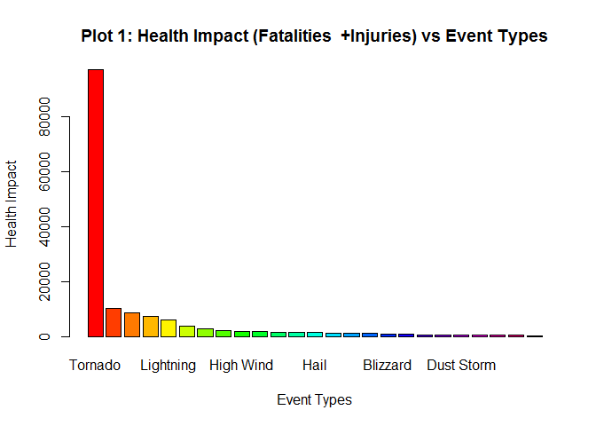
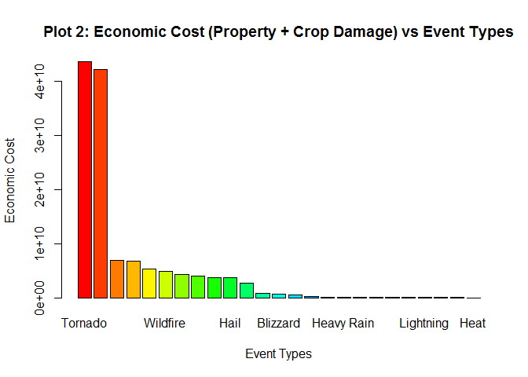

# NOAA Storm Database Exploration for Health Impact and Economic Cost
AK  
09/25/2015  

##Synopsis
The objective of this report is to present the analysis done on the NOAA Storm database to determine the health impact and economic costs of severe weather events such as tornodoes, thundurstorms, earthquake etc and determine the weather event that has the most impact. The harm to the population health was calculated as a sum of the fatalities and injuries while the economic cost was calculated as a sum of the property damage and crop damage in dollars (after factoring in the exponents post some clean-up). The entire analysis (including data download, pre-processing, clean-up and exploratory analysis) was done programatically for complete reproducibility using publicly available R-packages. The complete historically data (total records: 902297) was considered in the analysis without any specific weightings for the time and place of the data capture. Though there are a total of 985 weather events captured in the database since 1950, only 48 weather events are currently prevalent. Some basic clean-up relevant to address the questions was done to normalize these events as most others are non-consequential. Only top 25 events sorted by health impact and economic cost have been summarized in the figures for ease of presentation and review.

##Results:

Based on the analysis, it was determined that: 

- **Tornadoes are most harmful to the health of the population. Tornadoes cause a total of 5658 fatalities and 91364 injuries (total health impact: 97022).**  
Refer to Plot 1 and Table 1 to review the health impact of top 25 events.

- **Tornadoes are most impactful in terms of the economic cost. Tornadoes cause a total of 43,631,180,105 (~42Bn) in total cost (property damage: 43,487,203,105 and crop damage: 143,977,000**  
Refer to Plot 2 and Table 2 to review the economic cost of top 25 events.

- **The findings for the top 5 w.r.t health impact and the economic cost seem logical (related to tornadoes, storms, floods, heat and winds)**

## Data Processing


```r
        ##Setting the global options
        suppressWarnings(library(knitr))
        opts_chunk$set(echo = TRUE)
        opts_chunk$set(fig.path = "./figures/")
```


```r
        ##Load all the required libraries for the program
        ##Ignore the warnings as those have been checked to be harmless
        suppressWarnings(library(lubridate)) ##Required for date manipulation
        suppressWarnings(library(reshape2)) ##For melt and cast
        suppressWarnings(library(lattice)) ##Will use Lattice Graphing system for the last plot
        suppressWarnings(suppressMessages(library(dplyr)))##Required to mutate
        suppressWarnings(library(xtable)) ##To output tables
```


```r
        ##---Start of Code for downloading, reading and preprocessing data ---

        ##Download and unzip the data file
        zippeddataURL<-("https://d396qusza40orc.cloudfront.net/repdata%2Fdata%2FStormData.csv.bz2")

        ##Download the Zip File only if it is not already there.
        zippeddatafile <-"StormData.csv.bz2"
        if (!file.exists(zippeddatafile)){                
                download.file(zippeddataURL, zippeddatafile)
                dateDownloaded<-date()                                        
        }
                
        ##Now read the file in with the right parameters.
        stormdata <-read.table(zippeddatafile, header=TRUE, sep=",", na.strings="NA", 
                                stringsAsFactors=FALSE)

        ##Total number of entries
        entries<-nrow(stormdata) ##902297. So file read correctly.

        ##Let us first see how many unique event types are in the storm data 
        eventtypesindata<-unique(stormdata$EVTYPE)

        ##---End of Code for downloading, reading and preprocessing data ---
```

- The total number of records in the NOAA storm data is **902297**
- The total number of initial unique event types in the storm data is **985**


```r
        ##Normalize the PROPEXP and CROPEXP columns. 
  uniqueexp<-unique(stormdata$PROPDMGEXP)
        ##[1] "K" "M" ""  "B" "m" "+" "0" "5" "6" "?" "4" "2" "3" "h" "7" "H" "-" "1" "8"
        
        uniqueexp<-unique(stormdata$CROPDMGEXP)
        ##[1] ""  "M" "K" "m" "B" "?" "0" "k" "2"
        
        ##It is clear that there are some additional values. Data operators seem to have interpreted exponents as generic rather than just use K, M, B. So 2 is x100, 3 is x1000, 4 is x10000 etc.
        stormdata$PROPDMGEXP[which(stormdata$PROPDMGEXP=="H")]<-2
        stormdata$PROPDMGEXP[which(stormdata$PROPDMGEXP=="h")]<-2
        
        stormdata$PROPDMGEXP[which(stormdata$PROPDMGEXP=="K")]<-3
        stormdata$PROPDMGEXP[which(stormdata$PROPDMGEXP=="k")]<-3
        
        stormdata$PROPDMGEXP[which(stormdata$PROPDMGEXP=="M")]<-6
        stormdata$PROPDMGEXP[which(stormdata$PROPDMGEXP=="m")]<-6
        
        stormdata$PROPDMGEXP[which(stormdata$PROPDMGEXP=="B")]<-9
        stormdata$PROPDMGEXP[which(stormdata$PROPDMGEXP=="b")]<-9
        
        stormdata$PROPDMGEXP[which(stormdata$PROPDMGEXP=="")]<-0
        stormdata$PROPDMGEXP[which(stormdata$PROPDMGEXP=="?")]<-0
        stormdata$PROPDMGEXP[which(stormdata$PROPDMGEXP=="+")]<-0
        stormdata$PROPDMGEXP[which(stormdata$PROPDMGEXP=="-")]<-0          
        
        stormdata$CROPDMGEXP[which(stormdata$CROPDMGEXP=="H")]<-2
        stormdata$CROPDMGEXP[which(stormdata$CROPDMGEXP=="h")]<-2
        
        stormdata$CROPDMGEXP[which(stormdata$CROPDMGEXP=="K")]<-3
        stormdata$CROPDMGEXP[which(stormdata$CROPDMGEXP=="k")]<-3
        
        stormdata$CROPDMGEXP[which(stormdata$CROPDMGEXP=="M")]<-6
        stormdata$CROPDMGEXP[which(stormdata$CROPDMGEXP=="m")]<-6
        
        stormdata$CROPDMGEXP[which(stormdata$CROPDMGEXP=="B")]<-9
        stormdata$CROPDMGEXP[which(stormdata$CROPDMGEXP=="b")]<-9
        
        
        stormdata$CROPDMGEXP[which(stormdata$CROPDMGEXP=="")]<-0
        stormdata$CROPDMGEXP[which(stormdata$CROPDMGEXP=="?")]<-0
        stormdata$CROPDMGEXP[which(stormdata$CROPDMGEXP=="+")]<-0
        stormdata$CROPDMGEXP[which(stormdata$CROPDMGEXP=="-")]<-0  

        ##This standard event type list is retrieved from the Storm Data Event Table on Page 6
        ##https://d396qusza40orc.cloudfront.net/repdata%2Fpeer2_doc%2Fpd01016005curr.pdf

        stdeventypes<-c(
        "Astronomical Low Tide","Avalanche","Blizzard","Coastal Flood","Cold/Wind Chill",
        "Debris Flow","Dense Fog","Dense Smoke","Drought","Dust Devil","Dust Storm",
        "Excessive Heat","Extreme Cold/Wind Chill","Flash Flood","Flood","Frost/Freeze",
        "Funnel Cloud","Freezing Fog","Hail","Heat","Heavy Rain","Heavy Snow","High Surf",
        "High Wind","Hurricane/Typhoon","Ice Storm","Lake-Effect Snow","Lakeshore Flood",
        "Lightning","Marine Hail","Marine High Wind","Marine Strong Wind",
        "Marine Thunderstorm Wind","Rip Current","Seiche","Sleet","Storm Surge/Tide",
        "Strong Wind","Thunderstorm Wind","Tornado","Tropical Depression","Tropical Storm",
        "Tsunami","Volcanic Ash","Waterspout","Wildfire","Winter Storm","Winter Weather")

        ##Pass 1: Correct event types that start with the standard ones above
        for (i in 1:length(stdeventypes)){
                stormdata$EVTYPE[grep(paste0("^", stdeventypes[i]), stormdata$EVTYPE, ignore.case=T)]<-stdeventypes[i]
        }

        ##Pass 2: Correct the few top events
        stormdata$EVTYPE[grep("^TSTM WIND",stormdata$EVTYPE, ignore.case=T)]<- "Thunderstorm Wind"
        stormdata$EVTYPE[grep("^FOG",stormdata$EVTYPE, ignore.case=T)]<- "Dense Fog"
        stormdata$EVTYPE[which(stormdata$EVTYPE=="WILD/FOREST FIRE")]<-"Wildfire"
        stormdata$EVTYPE[which(stormdata$EVTYPE=="WILD FIRES")]<-"Wildfire"
        stormdata$EVTYPE[which(stormdata$EVTYPE=="HEAT WAVE")]<-"Excessive Heat"
        stormdata$EVTYPE[which(stormdata$EVTYPE=="EXTREME HEAT")]<-"Excessive Heat"
        stormdata$EVTYPE[which(stormdata$EVTYPE=="STORM SURGE")]<-"Storm Surge/Tide"
        stormdata$EVTYPE[which(stormdata$EVTYPE=="TYPHOON")]<-"Hurricane/Typhoon"
        stormdata$EVTYPE[which(stormdata$EVTYPE=="WINTRY MIX")]<-"Winter Weather"
        stormdata$EVTYPE[which(stormdata$EVTYPE=="GLAZE")]<-"Sleet"
        stormdata$EVTYPE[grep("^HURRICANE",stormdata$EVTYPE, ignore.case=T)]<- "Hurricane/Typhoon"
        stormdata$EVTYPE[grep("^GUSTY WIND",stormdata$EVTYPE, ignore.case=T)]<- "Strong Wind"
        stormdata$EVTYPE[grep("^WIND",stormdata$EVTYPE, ignore.case=T)]<- "High Wind"
        stormdata$EVTYPE[which(stormdata$EVTYPE=="EXTREME COLD")]<-"Extreme Cold/Wind Chill"
        stormdata$EVTYPE[which(stormdata$EVTYPE=="EXCESSIVE RAINFALL")]<-"Heavy Rain"
        stormdata$EVTYPE[grep("^FREEZE",stormdata$EVTYPE, ignore.case=T)]<- "Frost/Freeze"
        stormdata$EVTYPE[grep("^SNOW",stormdata$EVTYPE, ignore.case=T)]<- "Heavy Snow"
        stormdata$EVTYPE[grep("^ICE",stormdata$EVTYPE, ignore.case=T)]<- "Ice Storm"

        ##Assuming that Landslies are caused by Heavy Rains
        stormdata$EVTYPE[grep("^LANDSLIDE",stormdata$EVTYPE, ignore.case=T)]<-"Heavy Rain"
```

###Q1: Across the United States, which types of events are most harmful with respect to population health?


```r
        ##---Start of Code to Answer Q1 ---
        ##Using storm data frame from loaddata r code chunk above. Remove the NAs. Retain values that are non-zero.  This is being done given the question to be answered w.r.t fatalities and injuries (harmful to population health)
        stormdata<-subset(stormdata, !is.na(FATALITIES) & !is.na(INJURIES) & (FATALITIES>0 | INJURIES>0))

        ##One can use group by approach below but I like melt and cast
        ##Now melt the data set with event type as ID.
        meltedstormdatabyevent <- melt(stormdata, id.vars = c("EVTYPE"), measure.vars=c("FATALITIES", "INJURIES"))
        
        ##Then cast the data set with event type as ID and calculate the average by event type
        castedstormdatabyevent <- dcast(meltedstormdatabyevent, EVTYPE~variable,sum)
                                
        ##Introduce a column HEALTHIMPACT that is a sum of FATALITIES and INJURIES
        castedstormdatabyevent <- mutate(castedstormdatabyevent, HEALTHIMPACT=round(FATALITIES+INJURIES))
        
        ##Order by HEALTHIMPACT
        castedstormdatabyevent<-arrange(castedstormdatabyevent,desc(HEALTHIMPACT))

        ##Get the max health impact and the corresponding event
        maxheathimpact<-max(castedstormdatabyevent$HEALTHIMPACT)
        eventtypewithmaxheathimpact<-castedstormdatabyevent[which(castedstormdatabyevent$HEALTHIMPACT==maxheathimpact), ][1,1]

        ##Plot and print the table for Top 25 events only
        top25<-head(castedstormdatabyevent, 25)
        par(mfcol=c(1,1))
        barplot(top25$HEALTHIMPACT, names.arg=top25$EVTYPE, main="Plot 1: Health Impact (Fatalities  +Injuries) vs Event Types", 
          xlab="Event Types", ylab="Health Impact", col=rainbow(25))
```

 

```r
        healthimpact<-xtable(top25, caption="Table 1: Health Impact for top 25 event types")
        print(healthimpact, type="html")
```

<!-- html table generated in R 3.2.0 by xtable 1.7-4 package -->
<!-- Thu Sep 24 15:49:25 2015 -->
<table border=1>
<caption align="bottom"> Table 1: Health Impact for top 25 event types </caption>
<tr> <th>  </th> <th> EVTYPE </th> <th> FATALITIES </th> <th> INJURIES </th> <th> HEALTHIMPACT </th>  </tr>
  <tr> <td align="right"> 1 </td> <td> Tornado </td> <td align="right"> 5658.00 </td> <td align="right"> 91364.00 </td> <td align="right"> 97022.00 </td> </tr>
  <tr> <td align="right"> 2 </td> <td> Thunderstorm Wind </td> <td align="right"> 709.00 </td> <td align="right"> 9458.00 </td> <td align="right"> 10167.00 </td> </tr>
  <tr> <td align="right"> 3 </td> <td> Excessive Heat </td> <td align="right"> 1999.00 </td> <td align="right"> 6680.00 </td> <td align="right"> 8679.00 </td> </tr>
  <tr> <td align="right"> 4 </td> <td> Flood </td> <td align="right"> 495.00 </td> <td align="right"> 6806.00 </td> <td align="right"> 7301.00 </td> </tr>
  <tr> <td align="right"> 5 </td> <td> Lightning </td> <td align="right"> 817.00 </td> <td align="right"> 5232.00 </td> <td align="right"> 6049.00 </td> </tr>
  <tr> <td align="right"> 6 </td> <td> Heat </td> <td align="right"> 1118.00 </td> <td align="right"> 2494.00 </td> <td align="right"> 3612.00 </td> </tr>
  <tr> <td align="right"> 7 </td> <td> Flash Flood </td> <td align="right"> 1018.00 </td> <td align="right"> 1785.00 </td> <td align="right"> 2803.00 </td> </tr>
  <tr> <td align="right"> 8 </td> <td> Ice Storm </td> <td align="right"> 96.00 </td> <td align="right"> 2115.00 </td> <td align="right"> 2211.00 </td> </tr>
  <tr> <td align="right"> 9 </td> <td> High Wind </td> <td align="right"> 318.00 </td> <td align="right"> 1558.00 </td> <td align="right"> 1876.00 </td> </tr>
  <tr> <td align="right"> 10 </td> <td> Wildfire </td> <td align="right"> 90.00 </td> <td align="right"> 1606.00 </td> <td align="right"> 1696.00 </td> </tr>
  <tr> <td align="right"> 11 </td> <td> Winter Storm </td> <td align="right"> 217.00 </td> <td align="right"> 1353.00 </td> <td align="right"> 1570.00 </td> </tr>
  <tr> <td align="right"> 12 </td> <td> Hurricane/Typhoon </td> <td align="right"> 135.00 </td> <td align="right"> 1333.00 </td> <td align="right"> 1468.00 </td> </tr>
  <tr> <td align="right"> 13 </td> <td> Hail </td> <td align="right"> 15.00 </td> <td align="right"> 1361.00 </td> <td align="right"> 1376.00 </td> </tr>
  <tr> <td align="right"> 14 </td> <td> Heavy Snow </td> <td align="right"> 142.00 </td> <td align="right"> 1137.00 </td> <td align="right"> 1279.00 </td> </tr>
  <tr> <td align="right"> 15 </td> <td> Dense Fog </td> <td align="right"> 81.00 </td> <td align="right"> 1077.00 </td> <td align="right"> 1158.00 </td> </tr>
  <tr> <td align="right"> 16 </td> <td> Rip Current </td> <td align="right"> 577.00 </td> <td align="right"> 529.00 </td> <td align="right"> 1106.00 </td> </tr>
  <tr> <td align="right"> 17 </td> <td> Blizzard </td> <td align="right"> 101.00 </td> <td align="right"> 805.00 </td> <td align="right"> 906.00 </td> </tr>
  <tr> <td align="right"> 18 </td> <td> Winter Weather </td> <td align="right"> 62.00 </td> <td align="right"> 615.00 </td> <td align="right"> 677.00 </td> </tr>
  <tr> <td align="right"> 19 </td> <td> Extreme Cold/Wind Chill </td> <td align="right"> 285.00 </td> <td align="right"> 255.00 </td> <td align="right"> 540.00 </td> </tr>
  <tr> <td align="right"> 20 </td> <td> Heavy Rain </td> <td align="right"> 139.00 </td> <td align="right"> 329.00 </td> <td align="right"> 468.00 </td> </tr>
  <tr> <td align="right"> 21 </td> <td> Dust Storm </td> <td align="right"> 22.00 </td> <td align="right"> 440.00 </td> <td align="right"> 462.00 </td> </tr>
  <tr> <td align="right"> 22 </td> <td> Tropical Storm </td> <td align="right"> 66.00 </td> <td align="right"> 383.00 </td> <td align="right"> 449.00 </td> </tr>
  <tr> <td align="right"> 23 </td> <td> Strong Wind </td> <td align="right"> 116.00 </td> <td align="right"> 313.00 </td> <td align="right"> 429.00 </td> </tr>
  <tr> <td align="right"> 24 </td> <td> Avalanche </td> <td align="right"> 224.00 </td> <td align="right"> 170.00 </td> <td align="right"> 394.00 </td> </tr>
  <tr> <td align="right"> 25 </td> <td> High Surf </td> <td align="right"> 104.00 </td> <td align="right"> 156.00 </td> <td align="right"> 260.00 </td> </tr>
   </table>

```r
        ##---End of Code to Answer Q1 ---
```

- The maximum health impact is due to event **Tornado** in terms of total human fatalities and injuries of **97,022**

###Q2: Across the United States, which types of events have the greatest economic consequences?


```r
        ##---Start of Code to Answer Q2 ---
        ##Using storm data frame from loaddata r code chunk above. Remove the NAs. Retain values that are non-zero.  This is being done given the question to be answered w.r.t property damage and crop damage (economic cost)
        stormdata<-subset(stormdata, !is.na(PROPDMG) & !is.na(CROPDMG) & (PROPDMG>0 | CROPDMG>0))

         
                
        ##Convert the Property Damage and Crop Damage Cost using the repaired exponents
        stormdata <- mutate(stormdata, PROPDMG=PROPDMG*(10^(as.numeric(PROPDMGEXP))), CROPDMG=CROPDMG*(10^(as.numeric(CROPDMGEXP))))

        ##One can use group by approach below but I like melt and cast
        ##Now melt the data set with event type as ID.
        meltedstormdatabyevent <- melt(stormdata, id.vars = c("EVTYPE"), measure.vars=c("PROPDMG", "CROPDMG"))
        
        ##Then cast the data set with event type as ID and calculate the average by event type
        castedstormdatabyevent <- dcast(meltedstormdatabyevent, EVTYPE~variable,sum)
                                
        ##Introduce a column ECONOMICCOST that is a sum of PROPDMG and CROPDMG
        castedstormdatabyevent <- mutate(castedstormdatabyevent, ECONOMICCOST=round(PROPDMG+CROPDMG))

        ##Order by ECONOMICCOST
        castedstormdatabyevent<-arrange(castedstormdatabyevent,desc(ECONOMICCOST))
          
        ##Get the max economic cost and the corresponding event
        maxeconomiccost<-max(castedstormdatabyevent$ECONOMICCOST)
        eventtypewithmaxeconomiccost<-castedstormdatabyevent[which(castedstormdatabyevent$ECONOMICCOST==maxeconomiccost), ][1,1]
        
        ##Plot and print the table for Top 25 events only
        top25<-head(castedstormdatabyevent, 25)
        par(mfcol=c(1,1))
        barplot(top25$ECONOMICCOST, names.arg=top25$EVTYPE, main="Plot 2: Economic Cost (Property + Crop Damage) vs Event Types", 
          xlab="Event Types", ylab="Economic Cost", col=rainbow(25))
```

 

```r
        economiccost<-xtable(top25, caption="Table 2: Economic Cost for top 25 event types")
        print(economiccost, type="html")
```

<!-- html table generated in R 3.2.0 by xtable 1.7-4 package -->
<!-- Thu Sep 24 15:49:26 2015 -->
<table border=1>
<caption align="bottom"> Table 2: Economic Cost for top 25 event types </caption>
<tr> <th>  </th> <th> EVTYPE </th> <th> PROPDMG </th> <th> CROPDMG </th> <th> ECONOMICCOST </th>  </tr>
  <tr> <td align="right"> 1 </td> <td> Tornado </td> <td align="right"> 43487203105.00 </td> <td align="right"> 143977000.00 </td> <td align="right"> 43631180105.00 </td> </tr>
  <tr> <td align="right"> 2 </td> <td> Hurricane/Typhoon </td> <td align="right"> 38314160000.00 </td> <td align="right"> 3825350800.00 </td> <td align="right"> 42139510800.00 </td> </tr>
  <tr> <td align="right"> 3 </td> <td> Flood </td> <td align="right"> 6758761640.00 </td> <td align="right"> 169075500.00 </td> <td align="right"> 6927837140.00 </td> </tr>
  <tr> <td align="right"> 4 </td> <td> Tropical Storm </td> <td align="right"> 6560656000.00 </td> <td align="right"> 157765000.00 </td> <td align="right"> 6718421000.00 </td> </tr>
  <tr> <td align="right"> 5 </td> <td> Winter Storm </td> <td align="right"> 5281662500.00 </td> <td align="right"> 15783000.00 </td> <td align="right"> 5297445500.00 </td> </tr>
  <tr> <td align="right"> 6 </td> <td> Wildfire </td> <td align="right"> 4667112200.00 </td> <td align="right"> 188627000.00 </td> <td align="right"> 4855739200.00 </td> </tr>
  <tr> <td align="right"> 7 </td> <td> Flash Flood </td> <td align="right"> 4229270800.00 </td> <td align="right"> 48871750.00 </td> <td align="right"> 4278142550.00 </td> </tr>
  <tr> <td align="right"> 8 </td> <td> Storm Surge/Tide </td> <td align="right"> 4066020000.00 </td> <td align="right"> 0.00 </td> <td align="right"> 4066020000.00 </td> </tr>
  <tr> <td align="right"> 9 </td> <td> High Wind </td> <td align="right"> 3329602140.00 </td> <td align="right"> 354630150.00 </td> <td align="right"> 3684232290.00 </td> </tr>
  <tr> <td align="right"> 10 </td> <td> Hail </td> <td align="right"> 3505785701.00 </td> <td align="right"> 166300000.00 </td> <td align="right"> 3672085701.00 </td> </tr>
  <tr> <td align="right"> 11 </td> <td> Thunderstorm Wind </td> <td align="right"> 2491423793.00 </td> <td align="right"> 184893550.00 </td> <td align="right"> 2676317343.00 </td> </tr>
  <tr> <td align="right"> 12 </td> <td> Ice Storm </td> <td align="right"> 772861000.00 </td> <td align="right"> 20260000.00 </td> <td align="right"> 793121000.00 </td> </tr>
  <tr> <td align="right"> 13 </td> <td> Blizzard </td> <td align="right"> 526756000.00 </td> <td align="right"> 112050000.00 </td> <td align="right"> 638806000.00 </td> </tr>
  <tr> <td align="right"> 14 </td> <td> Excessive Heat </td> <td align="right"> 3607500.00 </td> <td align="right"> 492400000.00 </td> <td align="right"> 496007500.00 </td> </tr>
  <tr> <td align="right"> 15 </td> <td> Heavy Snow </td> <td align="right"> 225383250.00 </td> <td align="right"> 170000.00 </td> <td align="right"> 225553250.00 </td> </tr>
  <tr> <td align="right"> 16 </td> <td> Strong Wind </td> <td align="right"> 82985800.00 </td> <td align="right"> 63450000.00 </td> <td align="right"> 146435800.00 </td> </tr>
  <tr> <td align="right"> 17 </td> <td> Heavy Rain </td> <td align="right"> 109939000.00 </td> <td align="right"> 25000000.00 </td> <td align="right"> 134939000.00 </td> </tr>
  <tr> <td align="right"> 18 </td> <td> Tsunami </td> <td align="right"> 84000000.00 </td> <td align="right"> 20000.00 </td> <td align="right"> 84020000.00 </td> </tr>
  <tr> <td align="right"> 19 </td> <td> Waterspout </td> <td align="right"> 50110500.00 </td> <td align="right"> 0.00 </td> <td align="right"> 50110500.00 </td> </tr>
  <tr> <td align="right"> 20 </td> <td> Frost/Freeze </td> <td align="right"> 0.00 </td> <td align="right"> 50000000.00 </td> <td align="right"> 50000000.00 </td> </tr>
  <tr> <td align="right"> 21 </td> <td> Extreme Cold/Wind Chill </td> <td align="right"> 26037000.00 </td> <td align="right"> 1750000.00 </td> <td align="right"> 27787000.00 </td> </tr>
  <tr> <td align="right"> 22 </td> <td> Lightning </td> <td align="right"> 22335783.00 </td> <td align="right"> 3510050.00 </td> <td align="right"> 25845833.00 </td> </tr>
  <tr> <td align="right"> 23 </td> <td> Extreme Cold </td> <td align="right"> 0.00 </td> <td align="right"> 20000000.00 </td> <td align="right"> 20000000.00 </td> </tr>
  <tr> <td align="right"> 24 </td> <td> Dense Fog </td> <td align="right"> 16480000.00 </td> <td align="right"> 0.00 </td> <td align="right"> 16480000.00 </td> </tr>
  <tr> <td align="right"> 25 </td> <td> Heat </td> <td align="right"> 8415050.00 </td> <td align="right"> 1535000.00 </td> <td align="right"> 9950050.00 </td> </tr>
   </table>

```r
        ##---End of Code to Answer Q2 ---
```
- The maximum economic cost is due to event **Tornado** with a total cost of **43,631,180,105**

**--------------------------------------------End of the report--------------------------------------------------**
