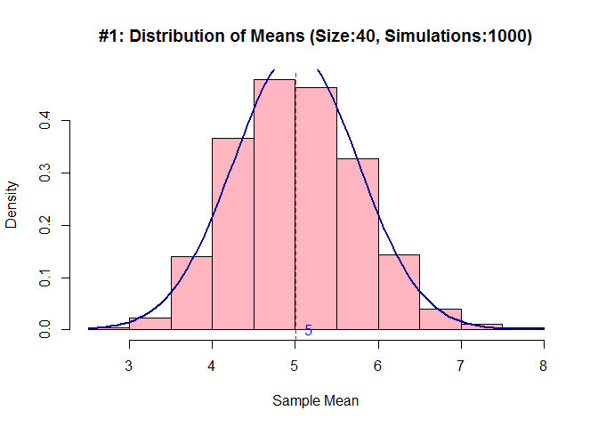
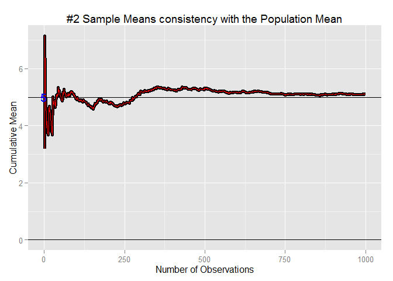

# Investigation of the Exponential Distribution and Comparision to the Central Limit Theorem
AK  
10/25/2015  
###Overview
This report investigates the expoential distribution using the function rexp(n,lambda). It simulates distribution of means of 40 exponentials,  using a total of 1000 simulations, and presents the following:

- 1/ The sample mean and its comparision  to the theoretical mean of the distribution.
- 2/ The variance of the sample and its comparision to the theoretical variance of the distribution.
- 3/ The proof that, in the limits, the distribution is approximately normal.

###Conclusions
Based on the analysis, it is determined that: 

- Sample mean is an estimator of population mean, with distribution centered at the population mean.(Plot #1 & #2)
- Sample variance is an estimator of population variance and its distribution centered at the population variance.(Plot #3 & #4)
- Distribution of the normalized sample means is a standard normal mean=0 & sd=1 (See Plot #5)

###Detailed Analysis
Code takes samples of 40 and runs a total of 1000 simulations. For each simulation, it calculates the sample mean and variance. It also calculates the commulative mean and variance to confirm the consistency for the distribution. It calculates the normalized mean used to confirm the nature of the distribution per CLT.


```r
##Setting the global options
suppressWarnings(library(knitr))
opts_chunk$set(echo = TRUE)
opts_chunk$set(fig.path = "./figures/")                
suppressWarnings(library(ggplot2)) ##To output plots
```


```r
##Set the parameters for the simulation
lambda<-0.2
popmean<-1/lambda
popsd<-1/lambda
popvar<-popsd^2
n<-40
nosim<-1000
expdist<-NULL
samplemeans<-NULL
samplevars<-NULL
normalizedmeans<-NULL

##Run 1000simulations
for (i in 1:nosim){   
        expdist<-rexp(n,lambda)
        samplemeans<-c(samplemeans, mean(expdist)) ##array of the sample means
        samplevars<-c(samplevars, var(expdist)) ##array of the sample variance
        normalizedmeans<-c(normalizedmeans, sqrt(n)*(mean(expdist)-popmean)/popsd) 
        }

##Statistics for the distribution of the sample means, sample variance 
meansamplemeans<- mean(samplemeans)
stdsamplemeans<- sd(samplemeans)
meansamplevars<- mean(samplevars)
stdsamplevars<- sd(samplevars)
meansnormalizedmeans<- mean(normalizedmeans)
stdnormalizedmeans<- sd(normalizedmeans)

##This is to double check on the consistency of the sample means and variance. 
cummeans<-cumsum(rexp(nosim,lambda))/1:nosim
cumvars<-cumsum((rexp(nosim,lambda)-cumsum(rexp(nosim,lambda))/1:nosim)^2)/1:nosim
```
- The mean of the sample means is **5.0396737** rounded to **5** as compared to theoretical population mean of **5**
- From plots #1 and #2 below, it is clear that the distribution of the sample mean is centered around the population mean and is consistent with the population mean as the number of simulations becomes large.

- The mean of the sample variances is **25.1949691** rounded to **25**  as compared to theoretical population variance of **25**
- Thus, from Plots #3 and #4 below, it is clear that the distribution of the sample variance is centered around the population variance and is consistent with the population variance as the simulations increase


```r
        ##Plot #5 the Normalized Mean (x-axis) vs Density/Probability (y-axis)
        par(mfcol=c(1,1))    
        hist(normalizedmeans, prob=TRUE, 
             col="orange",
             xlab="Normalized Mean", ylab="Density", 
             main="#5 Distribution of Normalized Means (Size:40, Simulations:1000)")
        curve(dnorm(x, mean=meansnormalizedmeans, sd=stdnormalizedmeans), add=TRUE,
              col="darkblue", lwd=2)
        abline(v = meansnormalizedmeans, col = "red", lty=2)
        text(meansnormalizedmeans, 0, round(meansnormalizedmeans),
                        pos=4, col="red")
```


- The mean of the normalized means is **0** and the standard deviation is **1**
- Thus, from Plot #5, it is clear that the distribution of normalized means is a standard normal N(0,1)

###Appendix

```r
       ##Plot #1 the Sample Mean (x-axis) vs Density/Probability (y-axis)
        par(mfcol=c(1,1))    
        hist(samplemeans, prob=TRUE, 
             col="lightpink",
             xlab="Sample Mean", ylab="Density", 
             main="#1: Distribution of Means (Size:40, Simulations:1000)")
        curve(dnorm(x, mean=meansamplemeans, sd=stdsamplemeans), add=TRUE,
              col="darkblue", lwd=2)
        abline(v = meansamplemeans, col = "red", lty=2)
        text(meansamplemeans, 0, round(meansamplemeans),
                        pos=4, col="blue")
```

 

```r
        ##Plot #2 Plot #2 the Cummulative Means (y-axis) vs Number of Observations
        gmeans<-ggplot(data.frame(x=1:nosim, y=cummeans),aes (x=x, y=y))
        gmeans<-gmeans+geom_hline(yintercept=0)+geom_line(size=2)
        gmeans<-gmeans+geom_hline(yintercept=popmean)+geom_line(size=2) + geom_line(color="red")
        gmeans<-gmeans+geom_text(x=0, y=popmean, label=popmean,color="blue")
        gmeans<-gmeans+ggtitle("#2 Sample Means consistency with the Population Mean")
        gmeans<-gmeans+labs(x="Number of Observations", y="Cumulative Mean")
        print(gmeans)
```

 


```r
        ##Plot #3 the Sample Variances (x-axis) vs Density/Probability (y-axis)
        par(mfcol=c(1,1))   
        hist(samplevars, prob=TRUE, 
             col="lightblue",
             xlab="Sample Variance", ylab="Density", 
             main="#3: Distribution of Variances (Size:40, Simulations:1000)")
        curve(dnorm(x, mean=meansamplevars, sd=stdsamplevars), add=TRUE,
              col="darkblue", lwd=2)
        abline(v = meansamplevars, col = "red", lty=2)
        text(meansamplevars, 0, round(meansamplevars),
                        pos=4, col="red")
```

 

```r
        ##Plot #4 the Cummulative Variance (y-axis) vs Number of Observations
        gvars<-ggplot(data.frame(x=1:nosim, y=cumvars),aes (x=x, y=y))
        gvars<-gvars+geom_hline(yintercept=0)+geom_line(size=2)
        gvars<-gvars+geom_hline(yintercept=popvar)+geom_line(size=2) + geom_line(color="blue")
        gvars<-gvars+geom_text(x=0, y=popvar, label=popvar,color="red")
        gvars<-gvars+ggtitle("#4 Sample Variance consistency with the Population Variance")
        gvars<-gvars+labs(x="Number of Observations", y="Cumulative Variance")
        print(gvars)
```

 

**--------------------------------------------End of the report--------------------------------------------------**
