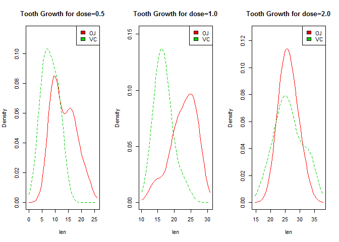

# Analysis of the effect of Vitamin C on tooth growth in guinea pigs
AK  
10/25/2015  
###Overview
This report analyzes the ToothGrowth data. The response is the length of odontoblasts (cells responsible for tooth growth) in 60 guinea pigs. Each animal received one of three dose levels of vitamin C (0.5, 1, and 2 mg/day) by one of two delivery methods, (orange juice or ascorbic acid (a form of vitamin C and coded as VC). This report performs some exploratory data analysis and provides a basic summary of the data. Confidence intervals and/or hypothesis tests are presented to compare tooth growth by supp and dose. Conclusions and the assumptions have also been summarized 

###Conclusions
Based on the analysis below, it is determined that: 

- 1 For each of the two delivery methods (orange juice or ascorbic), on an average (sampling), higher doses lead to greater tooth growth. Hence higher doses are more effective. **See Plot #3**
- 2 On an average (sampling), OJ contributes to greater tooth growth compared to VC for doses 0.5 and 1.0, though the same cannot be said for dose = 2.0 with 95% confidence level. Hence for 0.5 and 1.0, OJ is more effective than VC. **See Table #1**

###Assumptions

- 1 There are 60 different subjects (guinea pigs) and hence no pairing across groups has been done.
- 2 There are a total of 6 groups (by supp+dose).
- 3 The sample variances are different.
- 4 Two Tailed setting has been used for the Welch Tests

###Exploratory Data Analysis
The code first summarizes the data, determines the distribution of mean


```r
        ##Setting the global options
        suppressWarnings(library(knitr))
        opts_chunk$set(echo = TRUE)
        opts_chunk$set(fig.path = "./figures/")   

        suppressWarnings(library(lattice)) ##To output panel plots
        suppressWarnings(library(xtable)) ##To output tables
        suppressWarnings(library(sm)) ##To output density plots
```

```
## Package 'sm', version 2.2-5.4: type help(sm) for summary information
```


```r
        ##This code chunk loads the data and determines the basic construct of it.
        data(ToothGrowth) ##Load the tooth growth data
        labels<-names(ToothGrowth)
        noobs<-nrow(ToothGrowth)
        supplements<-unique(ToothGrowth$supp) ##supp
        doses<-unique(ToothGrowth$dose) ##dose
```
Here is the description of the tooth growth data set: 

- Names of Columns **len, supp, dose** 
- Total Number of Observations **60** 
- Type of Supplements (Delivery Methods)**VC, OJ**
- Doses (in mg/day) **0.5, 1, 2**


```r
        ##This code chunk persons exploratory data analysis on tooth growth.
        ##Let us first get a sense of the raw data
        xyplot(len~dose | factor(supp),
                data=ToothGrowth, main="Plot #1: Tooth Growth vs Dose",  
                xlab="dose", ylab="len", pch=19,type=c("p","g"))
```

 

```r
        df05<-subset(ToothGrowth, dose==0.5)
        df10<-subset(ToothGrowth, dose==1.0)
        df20<-subset(ToothGrowth, dose==2.0)

        ##Let us explore the distribution of len for each dose and supp
        par(mfcol=c(1,3))
        df05$supp.f <- factor(df05$supp, levels= c("OJ", "VC"),labels = c("OJ", "VC"))
        sm.density.compare(df05$len, df05$supp, xlab="len")
        title(main="Tooth Growth for dose=0.5")
        colfill<-c(2:(2+length(levels(df05$supp.f)))) 
        legend("topright", levels(df05$supp.f), fill=colfill)

        df10$supp.f <- factor(df10$supp, levels= c("OJ", "VC"),labels = c("OJ", "VC"))
        sm.density.compare(df10$len, df10$supp, xlab="len")
        title(main="Tooth Growth for dose=1.0")
        colfill<-c(2:(2+length(levels(df10$supp.f)))) 
        legend("topright", levels(df10$supp.f), fill=colfill)

        df20$supp.f <- factor(df20$supp, levels= c("OJ", "VC"),labels = c("OJ", "VC"))
        sm.density.compare(df20$len, df20$supp, xlab="len")
        title(main="Tooth Growth for dose=2.0")
        colfill<-c(2:(2+length(levels(df20$supp.f)))) 
        legend("topright", levels(df20$supp.f), fill=colfill)
```

 

```r
        ##Distributions Plot #3 indicate that the underlying data can be statistically analyzed with various methods

        par(mfcol=c(1,1))
        ##Let us get a sense of the sample data and its len variances across supp+dose
        boxplot(len~supp*dose, data=ToothGrowth, notch=FALSE, 
                col=(c("orange","yellow")),
                main="Plot #3: Tooth Growth by Supplement Type and Dose", 
                xlab="Supplement plus Dose")
```

 

```r
        ##From Plot #3, it is clear that or each of the two delivery methods (orange juice or ascorbic), on an average (sampling), higher doses lead to greater tooth growth. But we need to run the t tests to figure out the effect of OJ vs VC given a certain dose
```


```r
        ##This code chunk performs the t-tests to figure out the effect of OJ vs VC given a certain dose
        dfOJ05<-subset(ToothGrowth, supp=="OJ" & dose==0.5) ##Observations = 10
        dfOJ10<-subset(ToothGrowth, supp=="OJ" & dose==1.0) ##Observations = 10
        dfOJ20<-subset(ToothGrowth, supp=="OJ" & dose==2.0) ##Observations = 10
        dfVC05<-subset(ToothGrowth, supp=="VC" & dose==0.5) ##Observations = 10
        dfVC10<-subset(ToothGrowth, supp=="VC" & dose==1.0) ##Observations = 10
        dfVC20<-subset(ToothGrowth, supp=="VC" & dose==2.0) ##Observations = 10

        ##Now Let us compare OJ and VC for the same dose levels
        tint_OJVC05<-t.test(dfOJ05$len, dfVC05$len, paired=FALSE, var.equal=FALSE)$conf.int
        tint_OJVC10<-t.test(dfOJ10$len, dfVC10$len, paired=FALSE, var.equal=FALSE)$conf.int
        tint_OJVC20<-t.test(dfOJ20$len, dfVC20$len, paired=FALSE, var.equal=FALSE)$conf.int

        dftests = data.frame(group1=character(), group2=character(), tlow=numeric(), thigh=numeric())
        dftests<-rbind(dftests,data.frame("group1"= "OJ05", "group2"="VC05", "tlow"=tint_OJVC05[1], "thigh"=tint_OJVC05[2]))
        dftests<-rbind(dftests,data.frame("group1"= "OJ10", "group2"="VC10", "tlow"=tint_OJVC10[1], "thigh"=tint_OJVC10[2]))
        dftests<-rbind(dftests,data.frame("group1"= "OJ20", "group2"="VC20", "tlow"=tint_OJVC20[1], "thigh"=tint_OJVC20[2]))
        print(xtable(dftests, caption="Table 1: T Intervals"), type="html")
```

<!-- html table generated in R 3.2.0 by xtable 1.7-4 package -->
<!-- Sat Oct 24 22:56:08 2015 -->
<table border=1>
<caption align="bottom"> Table 1: T Intervals </caption>
<tr> <th>  </th> <th> group1 </th> <th> group2 </th> <th> tlow </th> <th> thigh </th>  </tr>
  <tr> <td align="right"> 1 </td> <td> OJ05 </td> <td> VC05 </td> <td align="right"> 1.72 </td> <td align="right"> 8.78 </td> </tr>
  <tr> <td align="right"> 2 </td> <td> OJ10 </td> <td> VC10 </td> <td align="right"> 2.80 </td> <td align="right"> 9.06 </td> </tr>
  <tr> <td align="right"> 3 </td> <td> OJ20 </td> <td> VC20 </td> <td align="right"> -3.80 </td> <td align="right"> 3.64 </td> </tr>
   </table>

```r
        ##The T-confidence intervals in Table 1 indicate On an average (sampling), OJ contributes to greater tooth growth compared to VC for doses 0.5 and 1.0, though the same cannot be said for dose = 2.0 with 95% confidence level.
```
**--------------------------------------------End of the report--------------------------------------------------**
