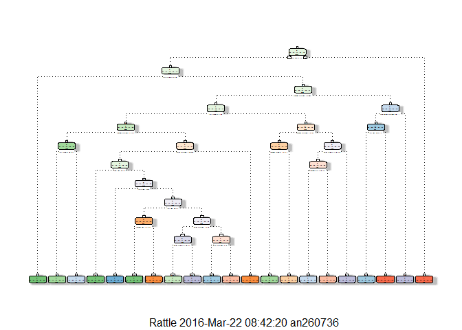

# Coursera Practical Machine Learning - Final Project Desertation
AK  
03/22/2016  
##1: Executive Summary
The objective of this exercise is to predict the manner in which the subjects exercised. It cleans and partitions the data, runs the classification tree and random forest models, compares their accuracy and predicts using the given testing set. 

Using the analysis below, we determined that 

- Random forest model is more accurate with an accuracy of **0.9925** compared to an accuracy of **0.722** for the classification tree model.
- The prediction using the Random Forest Model is **B A B A A E D B A A B C B A E E A B B B**

##2: Loading, Cleaning and Partitioning the Training and Testing Data
###2.1: Download the training and testing data from the URLs

```r
        ##---Start of Code for loading data ---
        suppressWarnings(suppressMessages(library(knitr)))
        suppressWarnings(suppressMessages(library(caret)))
        suppressWarnings(suppressMessages(library(rpart)))
        suppressWarnings(suppressMessages(library(randomForest)))
        suppressWarnings(suppressMessages(library(rattle)))
        opts_chunk$set(echo = TRUE)
        opts_chunk$set(fig.path = "./figures/")
        
        ##Check if the training data exists in the current directory. If not, download
        trainingdatafile<-"pml-training.csv"
        if (!file.exists(trainingdatafile)){
                download.file("https://d396qusza40orc.cloudfront.net/predmachlearn/pml-training.csv", trainingdatafile)
          dateDownloaded<-date()
    
        }
        training <-read.table(trainingdatafile, header=TRUE, sep=",", na.strings=c("NA","#DIV/0!",""))
        
        ##Check if the testing data exists in the current directory. If not, download
        testingdatafile<-"pml-testing.csv"
        if (!file.exists(testingdatafile)){
                download.file("https://d396qusza40orc.cloudfront.net/predmachlearn/pml-testing.csv", testingdatafile)
          dateDownloaded<-date()
    
        }
        testing <-read.table(testingdatafile, header=TRUE, sep=",", na.strings=c("NA","#DIV/0!",""))
        
        ##
```
###2.2 Clean, subset, sanitize and partition the data if required.

```r
        ##Ensuring that both the training and the testing sets have the same number of columns
        print(dim(training)) ##19622 x 160
```

```
## [1] 19622   160
```

```r
        print(dim(testing)) ##20 x 160
```

```
## [1]  20 160
```

```r
        ##Stage 1: Clean-up
        ##Remove columns that don't seem like row ids, labels, time stamps. Essentially, first 7 rows
        training <- training[,8:160] ##19622 xx 153
        testing <- testing[,8:160] ##20 x 153
        
        ##Remove columns in testing set that have all rows NA
        testingClean<-testing[, colSums(is.na(testing)) != nrow(testing)] ##19622 x 53
     
        testingCleanCol<-names(testingClean)
        testingCleanCol<-testingCleanCol[1:length(testingCleanCol)-1] ##Except the problm id column
        testingCleanCol<-c(testingCleanCol, "classe") ##Retain the classe column in the training set
        
        ##Retain only the above columns in the training set to that they match with the testing set
        trainingClean<-training[,colnames(training) %in% testingCleanCol] ##20 x 53
      
        ##Stage 2 Clean-up
        ##Check for variables with low variability
        trainingNearZeroVar <- nearZeroVar(trainingClean, saveMetrics=TRUE)
        trainingNearZeroVar<-subset(trainingNearZeroVar, zeroVar==TRUE)
        print(nrow(trainingNearZeroVar)) ##0
```

```
## [1] 0
```

```r
        ##Since no such variables, there is no need for further  cleaning

        print(dim(trainingClean)) ##19622 x 53
```

```
## [1] 19622    53
```

```r
        print(dim(testingClean)) ##20 x 53
```

```
## [1] 20 53
```

```r
        ##Since the training set only has 20 rows, we will use it for validation. We will instead partition the training set as 70% for training and 30% for training
        
        set.seed(12345)
        intrainpart<-createDataPartition(y=trainingClean$classe,p=0.70, list=FALSE)
        trainingpart<-trainingClean[intrainpart,]
        testingpart<-trainingClean[-intrainpart,]

        print(dim(trainingpart)) ##13737 x 53
```

```
## [1] 13737    53
```

```r
        print(dim(testingpart)) ##5885 x 53
```

```
## [1] 5885   53
```

```r
        ##
```

##3. Perform Modeling
###3.1: Perform basic classification tree modeling using the partition training set and predict against the partition testing set

```r
    ##Create the regression model using the trainingpart set with pre-processing and validation
    set.seed(12345)
    rpartModel<-rpart(formula = classe ~ ., data = trainingpart, method="class") 
    fancyRpartPlot(rpartModel)
```



```r
    ##Predict using the testingpart set
    predictionsrpart <- predict(rpartModel, newdata=testingpart, type="class")
    rpartConfMatrix<-confusionMatrix(predictionsrpart, testingpart$classe)
    ##print(rpartConfMatrix)
    
    ##Confusion Matrix and Statistics

    ##       Reference
    ##Prediction    A    B    C    D    E
    ##         A 1498  196   69  106   25
    ##         B   42  669   85   86   92
    ##         C   43  136  739  129  131
    ##         D   33   85   98  553   44
    ##         E   58   53   35   90  790
    
    ##Overall Statistics
    
    ##               Accuracy : 0.722           
    ##                 95% CI : (0.7104, 0.7334)
    ##    No Information Rate : 0.2845          
    ##    P-Value [Acc > NIR] : < 2.2e-16       
    
    ##                  Kappa : 0.6467          
    ## Mcnemar's Test P-Value : < 2.2e-16       
    
    ##Statistics by Class:
    
    ##                     Class: A Class: B Class: C Class: D Class: E
    ##Sensitivity            0.8949   0.5874   0.7203  0.57365   0.7301
    ##Specificity            0.9060   0.9357   0.9097  0.94717   0.9509
    ##Pos Pred Value         0.7909   0.6869   0.6273  0.68020   0.7700
    ##Neg Pred Value         0.9559   0.9043   0.9390  0.91897   0.9399
    ##Prevalence             0.2845   0.1935   0.1743  0.16381   0.1839
    ##Detection Rate         0.2545   0.1137   0.1256  0.09397   0.1342
    ##Detection Prevalence   0.3218   0.1655   0.2002  0.13815   0.1743
    ##Balanced Accuracy      0.9004   0.7615   0.8150  0.76041   0.8405
    
    ##
```
- The accuracy of the classification tree model is **0.7220051**

###3.2 Perform random forest modeling using the partition training set and predict against the partition testing set

```r
    ##Create the regression model using the trainingpart set with pre-processing and data validation
    set.seed(12345)
    rforestModel<-randomForest(classe ~ ., data = trainingpart) 
    
    ##Predict using the testingpart set
    predictionsrforest <- predict(rforestModel, newdata=testingpart, type="class")
    rforestConfMatrix<-confusionMatrix(predictionsrforest, testingpart$classe)
    ##print(rforestConfMatrix)
    
    ##    Confusion Matrix and Statistics
    
    ##          Reference
    ##Prediction    A    B    C    D    E
    ##         A 1673   10    0    0    0
    ##         B    1 1126   10    0    0
    ##         C    0    3 1015   14    0
    ##         D    0    0    1  950    5
    ##         E    0    0    0    0 1077
    
    ##Overall Statistics
    
    ##               Accuracy : 0.9925        
    ##                 95% CI : (0.99, 0.9946)
    ##    No Information Rate : 0.2845        
    ##    P-Value [Acc > NIR] : < 2.2e-16     
    
    ##                  Kappa : 0.9905        
    ## Mcnemar's Test P-Value : NA            
    
    ##Statistics by Class:
    
    ##                     Class: A Class: B Class: C Class: D Class: E
    ##Sensitivity            0.9994   0.9886   0.9893   0.9855   0.9954
    ##Specificity            0.9976   0.9977   0.9965   0.9988   1.0000
    ##Pos Pred Value         0.9941   0.9903   0.9835   0.9937   1.0000
    ##Neg Pred Value         0.9998   0.9973   0.9977   0.9972   0.9990
    ##Prevalence             0.2845   0.1935   0.1743   0.1638   0.1839
    ##Detection Rate         0.2843   0.1913   0.1725   0.1614   0.1830
    ##Detection Prevalence   0.2860   0.1932   0.1754   0.1624   0.1830
    ##Balanced Accuracy      0.9985   0.9931   0.9929   0.9921   0.9977
    
    ##
```
- The accuracy of the random forest model is **0.9925234** and the sample error is **0.0074766**
Thus the random forest model is more accurate than the classification tree model. So we will use the random forest model to run prediction against the given training set.

##4.0 Validation against the given testing set of 20 records

```r
    predictionsrforesttesting <- predict(rforestModel, testingClean, type = "class")
    ##print(predictionsrforesttesting)

    ## 1  2  3  4  5  6  7  8  9 10 11 12 13 14 15 16 17 18 19 20 
    ## B  A  B  A  A  E  D  B  A  A  B  C  B  A  E  E  A  B  B  B 
    ## Levels: A B C D E
    ##
```
- So the prediction using the random forest model is **B  A  B  A  A  E  D  B  A  A  B  C  B  A  E  E  A  B  B  B **

**--------------------------------------------End of the report--------------------------------------------------**
