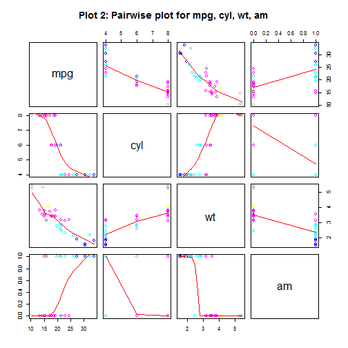

## Objective & Features of the Shiny Application

- The Shiny Appication enables the user to analyze the mtcars dataset and compare the fuel efficiency of the automatic and manual transmission cars.

- Left Pane: The user can choose from multiple linear regression models (radio buttons)

- Right Pane: The App displays the following to help user select the optimal model

  - Tab 1: Model Summary (chosen model)
  - Tab 2: Model Plot (chosen model)
  - Tab 3: Pair Wise Plot (for data set)
  - Tab 4: MPG vs Transmission Plot
- Bottom Pane: The App displays variance table ifor analyzing multivariable nested models.
  
- <a href="https://akoratkar.shinyapps.io/AKMileageAnalysisShinyApp/">Link to Mileage Analysis Shiny App on shinyapps.io</a>
- <a href="https://akoratkar.shinyapps.io/AKInteractiveMileageAnalysisShinyDocument/">Link to Mileage Analysis Shiny App R Markdown Documentation on shinyapps.io</a>

---


## Pair-wise Plot for mtcars
- This plot gives the user a high level view of the relationship among significant variables


---

## Guidelines for analyzing the regression models
- Review the pair-wise plot and mpg vs am plot to understand the variable relationships
- Run each regression model. Carefully review the R-Squared values. E.g.

```r
  summary(lm(mpg~wt+cyl+am, data=mtcars))$r.squared
```

```
## [1] 0.8303383
```
- Review the variable table for the nested model. E.g.
- Choose the model with the highest R-Squared value

```
##      Res.Df             RSS                Df        Sum of Sq         
##  "Min.   :27.00  " "Min.   :188.4  " "Min.   :1  " "Min.   : 0.06657  "
##  "1st Qu.:27.75  " "1st Qu.:188.5  " "1st Qu.:1  " "1st Qu.: 1.37308  "
##        F                   Pr(>F)          
##  "Min.   : 0.009538  " "Min.   :0.001497  "
##  "1st Qu.: 0.196751  " "1st Qu.:0.271090  "
```

---

## Sample Model Output: lm(mpg~wt+cyl+am)

```
## 
## Call:
## lm(formula = mpg ~ wt + cyl + am, data = mtcars)
## 
## Residuals:
##     Min      1Q  Median      3Q     Max 
## -4.1735 -1.5340 -0.5386  1.5864  6.0812 
## 
## Coefficients:
##             Estimate Std. Error t value Pr(>|t|)    
## (Intercept)  39.4179     2.6415  14.923 7.42e-15 ***
## wt           -3.1251     0.9109  -3.431  0.00189 ** 
## cyl          -1.5102     0.4223  -3.576  0.00129 ** 
## am            0.1765     1.3045   0.135  0.89334    
## ---
## Signif. codes:  0 '***' 0.001 '**' 0.01 '*' 0.05 '.' 0.1 ' ' 1
## 
## Residual standard error: 2.612 on 28 degrees of freedom
## Multiple R-squared:  0.8303,	Adjusted R-squared:  0.8122 
## F-statistic: 45.68 on 3 and 28 DF,  p-value: 6.51e-11
```


